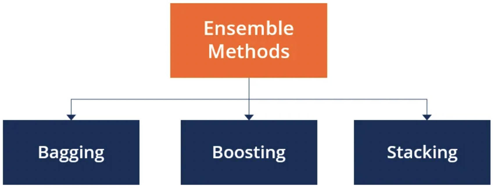

# Problem Understanding: Benign(2) vs malignant (4)
In this project, we aim to build  Machine Learning classifiers that predict wether a breast cancer is bengnin or malignant.

To achieve the goals we consider two cases:

Case1: Here we build single models namely Logistic regression, SVM, FCN, Decision tree.

Case2: Here we build combined models in order to form ensemble learning models. In this case tree approaches were considered
* Bagging algorithm;
* Adaboost algorithm;
* Voting algorithm.

### Ensemble Methods

